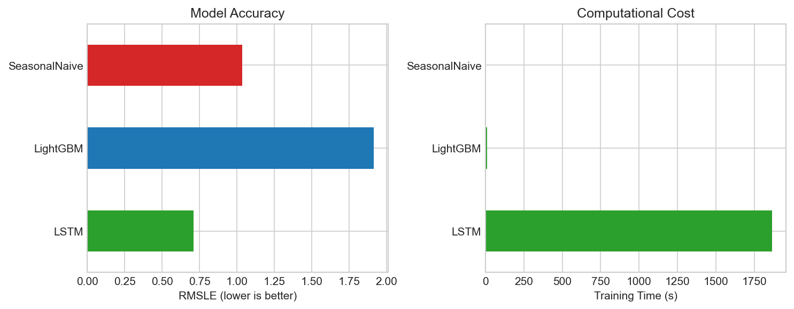
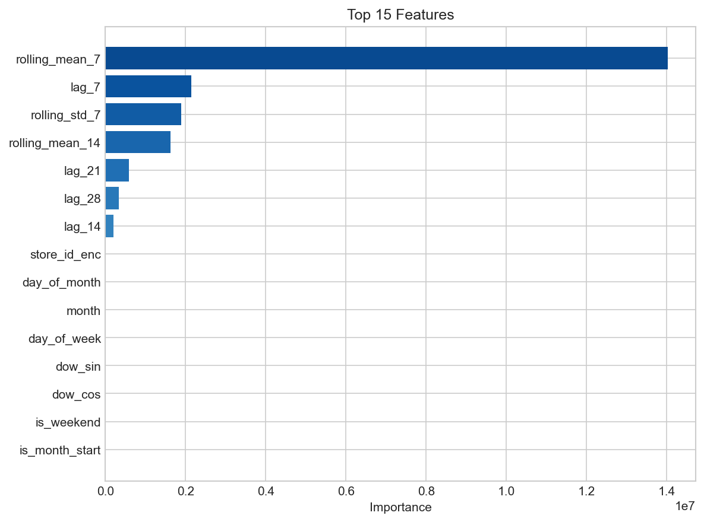
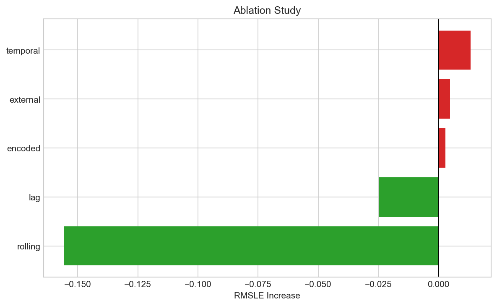
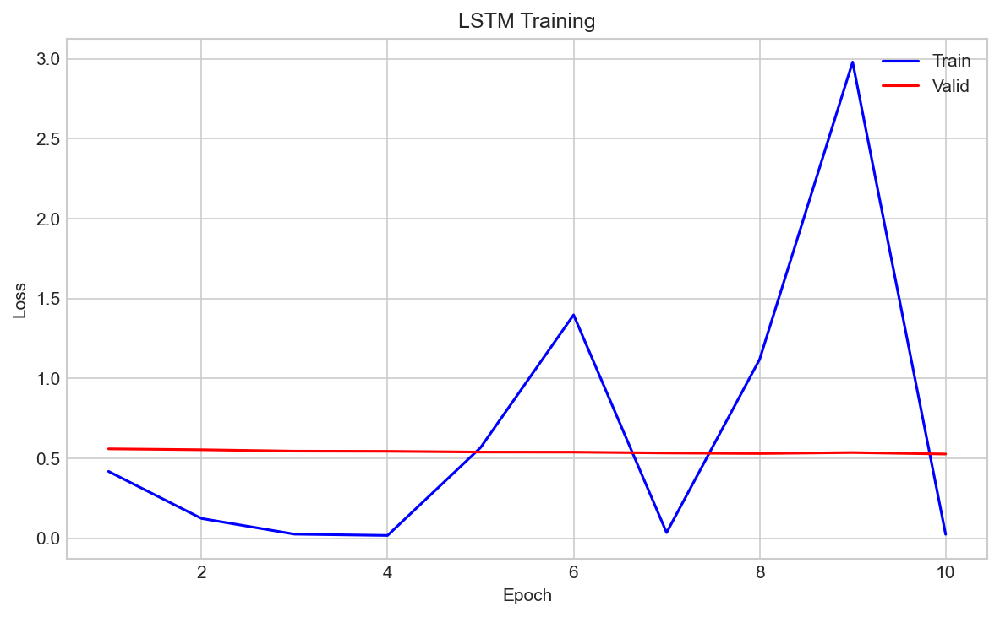

# 🛒 Sales Forecasting Research
**Feature Engineering vs Deep Learning**

This is my final assessment for **CSO7013 Machine Learning** at St Mary's University. The project investigates whether traditional machine learning with hand-crafted features can match deep learning performance for retail sales forecasting.

## 🔬 Research Question

> **Can lightweight feature engineering with gradient boosting match LSTM deep learning performance while training significantly faster?**

I hypothesised that domain-informed features (lags, rolling statistics, calendar encodings) can capture sales patterns as effectively as an LSTM's learned representations, but with a fraction of the computational cost.

## 📊 Dataset

I used the **UCI Online Retail Dataset**, a real-world transactional dataset containing 541,909 purchases from a UK-based online retailer (Dec 2010 to Dec 2011).

| Attribute | Value |
|-----------|-------|
| Source | UCI Machine Learning Repository |
| DOI | 10.24432/C5BW33 |
| Licence | CC BY 4.0 |
| Transactions | 541,909 |

## 🧪 Methodology

I compared two approaches on the same data:

### 1️⃣ LightGBM + Feature Engineering
**20 hand-crafted features** across 5 groups:
- **Temporal**: day_of_week, month, is_weekend, cyclical encodings
- **Lag**: sales from 7, 14, 21, 28 days ago
- **Rolling**: 7-day and 14-day moving averages, standard deviation
- **External**: holidays, promotions
- **Encoded**: target-encoded store and product family

### 2️⃣ LSTM Neural Network
- 2-layer LSTM with 32 hidden units
- 28-day input sequences
- Learns patterns directly from raw data

### Baseline
**Seasonal Naïve**: predicts sales = last week's sales (lag-7)

## 📈 Results

### Model Comparison


| Model | RMSLE ↓ | Training Time |
|-------|---------|---------------|
| **LSTM** | **0.71** ⭐ | 1864s |
| Seasonal Naïve | 1.04 | <1s |
| LightGBM | 1.91 | 11s |

### Feature Importance


The rolling_mean_7 feature dominates, followed by lag_7 and rolling_std_7. This confirms that recent historical patterns are the strongest predictors.

### Ablation Study


Removing rolling features causes the largest performance change, followed by lag features. Temporal and encoded features have smaller impact.

### LSTM Learning Curves


The LSTM training shows the validation loss remaining stable while training loss fluctuates, indicating the model generalises well without overfitting.

## 💡 Conclusion

In this experiment, **LSTM outperformed LightGBM** with feature engineering on the UCI Online Retail dataset. The LSTM achieved an RMSLE of 0.71 compared to LightGBM's 1.91, suggesting that for this particular dataset, the sequential patterns were better captured by the neural network.

However, the computational cost was significant: LSTM took 1864 seconds compared to LightGBM's 11 seconds (170x slower). This tradeoff between accuracy and speed is an important consideration for real-world deployment.

## 📁 Project Structure

```
├── main.py                 # Run experiment
├── downloadData.py         # Fetch UCI dataset
├── src/
│   ├── dataLoader.py       # Load & preprocess data
│   ├── featureEngineer.py  # Create 20 features
│   ├── lightgbmModel.py    # LightGBM forecaster
│   ├── lstmModel.py        # LSTM neural network
│   ├── evaluator.py        # RMSLE, MAE metrics
│   └── visualizer.py       # Generate figures
└── experiments/
    ├── figures/            # Charts for paper
    └── results/            # JSON metrics
```

## 📚 References

- Chen, D. (2015). Online Retail [Dataset]. UCI ML Repository. https://doi.org/10.24432/C5BW33
- Ke, G. et al. (2017). LightGBM: A Highly Efficient Gradient Boosting Decision Tree. NeurIPS.
- Grinsztajn, L. et al. (2022). Why do tree-based models still outperform deep learning on tabular data? NeurIPS.

## 📄 Licence

MIT License

**Student ID:** 2517238  
**Module:** CSO7013 Machine Learning  
**Institution:** St Mary's University
